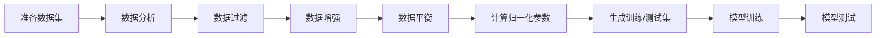

# 🚀 ResNet18 图像分类训练器

<div align="center">


一个功能完整、易于使用的 ResNet18 图像分类训练工具包

[功能特性](#-功能特性) • [快速开始](#-快速开始) • [使用指南](#-使用指南) • [项目结构](#-项目结构)

</div>

---

## 📖 项目简介

本项目提供了一个完整的基于 ResNet18 的图像分类训练流程，支持从数据准备、数据增强、模型训练到单图测试的全流程。项目代码简洁易懂，适合深度学习初学者学习和使用。

### ✨ 功能特性

- 🎯 **双模式训练**：支持从零训练和迁移学习两种训练模式
- 📊 **数据分析**：提供数据集分析工具，可视化数据分布和图像尺寸
- 🔄 **数据增强**：支持水平翻转、垂直翻转等数据增强方法
- ⚖️ **数据平衡**：自动平衡各类别样本数量
- 🧹 **数据过滤**：过滤不符合尺寸要求的图像
- 📈 **训练监控**：实时输出训练损失和验证准确率
- 💾 **模型保存**：自动保存最佳模型和定期检查点
- 🔍 **单图测试**：支持对单张图片进行预测

---

## 🛠️ 环境要求

### 依赖库

```
Python >= 3.8
PyTorch >= 2.2.2 (CUDA 12.1)
torchvision >= 0.17.2
Pillow >= 10.3.0
matplotlib >= 3.8.4
numpy >= 1.26.4
tqdm >= 4.66.2
opencv-python (用于数据增强)
```

### 硬件要求

- **推荐**：NVIDIA GPU (8GB+ 显存)
- **最低**：CPU (训练速度较慢)

---

## 🚀 快速开始

### 1. 克隆项目

```bash
git clone https://github.com/RFalcon-Mick/resnet18_trainer.git
cd resnet18_trainer
```

### 2. 安装依赖

```bash
pip install -r requirements.txt
```

### 3. 初始化项目

```bash
python setup.py
```

这将创建 `dataset` 和 `output` 两个文件夹。

### 4. 准备数据集

将您的图像数据按以下结构组织：

```
dataset/
├── 类别1/
│   ├── image1.jpg
│   ├── image2.jpg
│   └── ...
├── 类别2/
│   ├── image1.jpg
│   ├── image2.jpg
│   └── ...
└── ...
```

### 5. 生成训练/测试集

```bash
python ge_dataset.py
```

这将自动生成 `train.txt` 和 `test.txt` 文件（默认训练集占 90%）。

### 6. 开始训练

**从零训练**：
```bash
python resnet18.py
```

**迁移学习（推荐）**：
```bash
python pretrained_resnet18.py
```

---

## 📚 使用指南

### 数据准备工具

#### 1️⃣ 数据分析 (`data_info.py`)

分析数据集的分布情况和图像尺寸：

```bash
python data_info.py
```

**功能**：
- 生成数据分布条形图
- 生成图像尺寸散点图
- 计算各类别平均样本数

#### 2️⃣ 数据过滤 (`data_filter.py`)

过滤不符合要求的图像：

```bash
python data_filter.py
```

**可配置参数**：
- `min`：最小边长（默认 200px）
- `max`：最大边长（默认 2000px）
- `ratio`：最小长宽比（默认 0.5）

#### 3️⃣ 数据增强 (`data_argumentaion.py`)

对样本量不足的类别进行数据增强：

```bash
python data_argumentaion.py
```

**功能**：
- 对样本数 < 阈值的类别进行翻转增强
- 生成增强后的数据集到 `enhance_dataset` 文件夹
- 保持原始数据不变

**可配置参数**：
- `threshold`：数据增强阈值（默认 200）

#### 4️⃣ 数据平衡 (`data_balance.py`)

删除样本量过多的数据：

```bash
python data_balance.py
```

**可配置参数**：
- `threshold`：最大样本数（默认 300）
- `img_root`：数据集路径

#### 5️⃣ 数据归一化 (`data_normalization.py`)

计算数据集的均值和标准差：

```bash
python data_normalization.py
```

**输出示例**：
```python
mean = [0.522, 0.485, 0.426]
std = [0.205, 0.202, 0.207]
```

将输出的值更新到 `utils.py` 和 `single_picture_test.py` 中的 `transform_BZ`。

### 训练模型

#### 方式一：从零训练 (`resnet18.py`)

```bash
python resnet18.py
```

**特点**：
- 随机初始化模型参数
- 适合大规模数据集
- 训练时间较长

**可配置参数**：
```python
batch_size = 5          # 批次大小
classes = 55            # 分类数量
learning_rate = 1e-3    # 学习率
epochs = 500            # 训练轮数
```

#### 方式二：迁移学习 (`pretrained_resnet18.py`)

```bash
python pretrained_resnet18.py
```

**特点**：
- 使用 ImageNet 预训练权重
- 适合中小规模数据集
- 收敛速度快，效果更好

**可配置参数**：
```python
batch_size = 32         # 批次大小
classes = 55            # 分类数量
learning_rate = 1e-4    # 学习率
epochs = 50             # 训练轮数
```

**训练输出**：

模型和训练记录将保存到 `output` 文件夹：
- `resnet18_*.pth`：模型检查点
- `resnet18_*_best.pth`：最佳模型
- `resnet18_*_last.pth`：最后一个 epoch 的模型
- `resnet18_*.txt`：训练日志

### 模型测试

#### 单图测试 (`single_picture_test.py`)

对单张图片进行预测：

```bash
python single_picture_test.py
```

**使用步骤**：

1. 修改配置参数：
```python
img_path = r'path/to/your/image.jpg'  # 图片路径
classes = 55                           # 分类数量
model_path = r"output/resnet18_e_best.pth"  # 模型路径
```

2. 运行脚本获取预测结果

---

## 📁 项目结构

```
resnet18_trainer/
├── README.md                    # 项目说明文档
├── LICENSE                      # MIT 开源协议
├── requirements.txt             # 依赖库清单
├── setup.py                     # 项目初始化脚本
│
├── 数据准备
│   ├── ge_dataset.py           # 生成训练/测试集划分
│   ├── data_info.py            # 数据分析和可视化
│   ├── data_filter.py          # 数据过滤
│   ├── data_argumentaion.py    # 数据增强
│   ├── data_balance.py         # 数据平衡
│   └── data_normalization.py   # 计算归一化参数
│
├── 模型训练
│   ├── resnet18.py             # 从零训练
│   ├── pretrained_resnet18.py  # 迁移学习训练
│   └── utils.py                # 数据加载和工具函数
│
├── 模型测试
│   └── single_picture_test.py  # 单图预测
│
└── 工作目录
    ├── dataset/                # 原始数据集
    ├── enhance_dataset/        # 增强后数据集
    ├── output/                 # 训练输出（模型和日志）
    ├── train.txt               # 训练集列表
    └── test.txt                # 测试集列表
```

---

## 🔄 完整工作流程



### 推荐流程

1. **数据准备阶段**
   ```bash
   python setup.py                    # 初始化文件夹
   # 将数据放入 dataset/ 文件夹
   python data_info.py                # 分析数据
   python data_filter.py              # 过滤数据
   python data_argumentaion.py        # 数据增强
   python data_balance.py             # 数据平衡
   python data_normalization.py       # 计算归一化参数
   # 更新 utils.py 中的归一化参数
   ```

2. **训练阶段**
   ```bash
   python ge_dataset.py               # 生成数据集划分
   python pretrained_resnet18.py      # 开始训练（推荐迁移学习）
   ```

3. **测试阶段**
   ```bash
   python single_picture_test.py      # 单图测试
   ```

---

## 💡 使用技巧

### 1. 提高训练效果

- ✅ 使用迁移学习（`pretrained_resnet18.py`）通常效果更好
- ✅ 确保数据集各类别样本量均衡
- ✅ 适当调整学习率和批次大小
- ✅ 使用数据增强增加样本多样性

### 2. 解决常见问题

**显存不足**：
```python
# 减小 batch_size
batch_size = 8  # 或更小

# 减小 num_workers
num_workers = 0  # 或更小
```

**训练速度慢**：
```python
# 增加 num_workers（CPU）
num_workers = 8  # 根据 CPU 核心数调整

# 使用 pin_memory（GPU）
pin_memory = True
```

**过拟合**：
- 增加数据增强
- 减少训练轮数
- 使用正则化方法

### 3. 自定义修改

**修改分类数量**：
```python
# 在训练脚本中修改
classes = 你的类别数
```

**修改图像尺寸**：
```python
# 在 utils.py 中修改
self.img_size = 512  # 改为你需要的尺寸
```

**修改训练/测试比例**：
```python
# 在 ge_dataset.py 中修改
train_ratio = 0.9  # 改为你需要的比例
```

---

## 📊 训练监控

训练过程中会实时输出以下信息：

```
Epoch 1
-------------------------------
loss: 3.912345  [    0/  5000]
loss: 3.123456  [   50/  5000]
...
train time: 120.5
correct = 0.75, Test Error:
 Accuracy: 75.0%, Avg loss: 0.851234

Epoch 2
-------------------------------
...
```

训练日志保存格式（`output/resnet18_*.txt`）：

```
epoch    1    train_loss    0.123    val_loss    0.456    val_accuracy    0.789
epoch    2    train_loss    0.098    val_loss    0.432    val_accuracy    0.812
...
```

---

## 🎓 学习资源

- [PyTorch 官方文档](https://pytorch.org/docs/stable/index.html)
- [ResNet 论文](https://arxiv.org/abs/1512.03385)
- [图像分类入门教程](https://pytorch.org/tutorials/beginner/blitz/cifar10_tutorial.html)
- [迁移学习指南](https://pytorch.org/tutorials/beginner/transfer_learning_tutorial.html)

---

## 🤝 贡献

欢迎提交 Issue 和 Pull Request！

如果这个项目对您有帮助，请给一个 ⭐ Star 支持一下！

---

## 📄 开源协议

本项目采用 [MIT License](LICENSE) 开源协议。

---

## 👨‍💻 作者

**RFalcon**

---

## 📮 联系方式

如有问题或建议，欢迎通过以下方式联系：

- 提交 [Issue](https://github.com/RFalcon-Mick/resnet18_trainer/issues)
- 发起 [Pull Request](https://github.com/RFalcon-Mick/resnet18_trainer/pulls)

---

<div align="center">

**如果觉得项目不错，请点个 ⭐ Star 支持一下！**

Made with ❤️ by RFalcon

</div>
